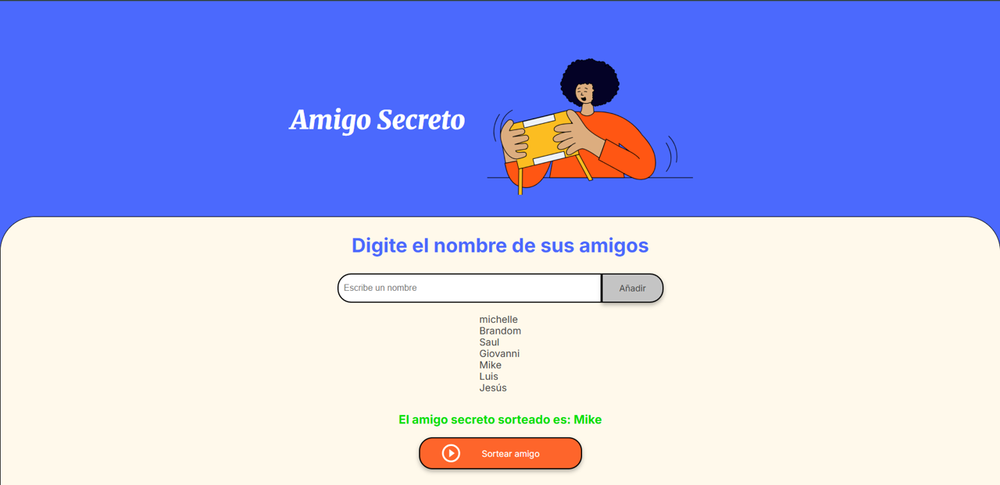

# 🎁 **_SORTEO DEL AMIGO SECRETO_** 🎁

## 📑 **Índice**

- [🎁 **_SORTEO DEL AMIGO SECRETO_** 🎁](#-sorteo-del-amigo-secreto-)
  - [📑 **Índice**](#-índice)
  - [📂Estructura de archivos](#estructura-de-archivos)
  - [🖼️ Vista previa del juego](#️-vista-previa-del-juego)
  - [🎯 Objetivo del proyecto:](#-objetivo-del-proyecto)
  - [📚 Nombre de las varibles y funciones:](#-nombre-de-las-varibles-y-funciones)
    - [📝 **Variables**](#-variables)
    - [🛠️ **Funciones**](#️-funciones)
  - [✏️ Cambiar nombres de variables y funciones:](#️-cambiar-nombres-de-variables-y-funciones)
  - [🌿 Ramas del repositorio](#-ramas-del-repositorio)
    - [✏️ Cambiar de rama:](#️-cambiar-de-rama)
  - [⚠️ Posibles mejoras](#️-posibles-mejoras)
  - [🌐 **Conecta conmigo**](#-conecta-conmigo)
    - [💼 Mi LinkedIn](#-mi-linkedin)
  - [🛠 **Tecnologías usadas**](#-tecnologías-usadas)

## 📂Estructura de archivos
```bash
/juego-numero-secreto
│── /assets
│   └── amigo-secreto.png
│   └── play_circle_outline.png
│   └── amigo-secreto-captura.png
│── index.html
│── style.css
│── app.js
└── README.md
```
## 🖼️ Vista previa del juego


## 🎯 Objetivo del proyecto:

Es poder ingresar nombres de los participantes y realizar el sorteo del amigo secreto. 

## 📚 Nombre de las varibles y funciones:

### 📝 **Variables**

|       Ingles          |       Español            |
|-----------------------|--------------------------|
|   friends             |    amigos                |
|   drawnFriend         |    amigoSorteado         |
|   minFriendsRequired  |    minimaCantidadAmigos  |
|   name                |    nombre                |
|   list                |    lista                 |
|   randomIndex         |    indiceAleatorio       |
|   resultDisplay       |    resultado             |

### 🛠️ **Funciones**

|          Ingles           |       Español            |
|---------------------------|--------------------------|
|   addFriend ()            |    agregarAmigo ()       |
|   focusInput ()           |    enfocarInput ()       |
|   clearInput ()           |    limpiarCampo ()       |
|   renderFriendList ()     |    listaDeAmigos ()      |
|   drawFriend ()           |    sortearAmigo ()       |


## ✏️ Cambiar nombres de variables y funciones:
Si quieres cambiarlas selecciona la primera palabra y presiona **ctrl + d** para seleccionar todas las palabras iguales cuantas veces aparezcan, luego escribe el nuevo nombre y luego presiona **esc** para salir del modo de selección múltiple.

>⚠️Ten cuidado al seleccionar, porque si tienen el mismo nombre en otro contexto, lo cambiará también,incluso si no es una variable o funcion con el mismo nombre.⚠️

## 🌿 Ramas del repositorio

| Rama                   | Descripción                                |
|------------------------|--------------------------------------------|
| `main`                 | Rama principal, versión en español        |
| `dev`                  | Rama de desarrollo, versión en inglés     |

### ✏️ Cambiar de rama:
1. Abre la terminal integrada en Visual Studio Code o abre git bash y navega hasta el proyecto, usando:
   ```bash
   cd ./challenge-amigo-secreto_esp-main
   ```

2. Asegúrate de estar en la carpeta del proyecto. Esto mostrará una lista de ramas locales. La rama actual estará marcada con un asterisco (*). Ejecuta el siguiente comando para ver las ramas disponibles:
   ```bash
   git branch
   ```

3. Ejecuta el siguiente comando para cambiar de rama de la version en Ingles:
   ```bash
   git checkout dev
   ```
   Para la version en Español:
   ```bash
   git checkout main
   ```

4. Si la rama no existe localmente, puedes crearla y cambiarte a ella al mismo tiempo con:
   ```bash
   git checkout -b <nombre-de-la-rama>
   ```

5. O si solo quieres cambiarte a una rama existente, ya sea dev o main:
   ```bash
   git switch <nombre-de-la-rama>
   ```


## ⚠️ Posibles mejoras
- 🔄 Permitir reiniciar el sorteo sin recargar la página.
- 🗃️ Guardar los resultados.
- 🎶 Agregar sonidos o animaciones.
---

## 🌐 **Conecta conmigo**
### 💼 Mi LinkedIn

[](https://www.linkedin.com/in/michelle-montoya-alvarado-792812237/)


## 🛠 **Tecnologías usadas**


