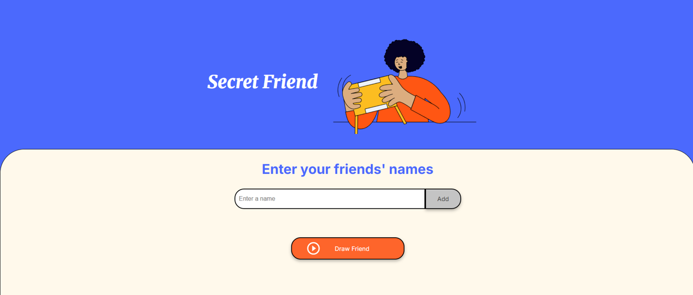

# 🎁 **_SECRET FRIEND DRAW_** 🎁

## 📑 **Table of Contents**

- [🎁 **_SECRET FRIEND DRAW_** 🎁](#-secret-friend-draw-)
  - [📑 **Table of Contents**](#-table-of-contents)
  - [📂 File Structure](#-file-structure)
  - [🖼️ Page Preview](#️-page-preview)
  - [🎯 Project Goal](#-project-goal)
  - [📚 Variable and Functions Names](#-variable-and-functions-names)
    - [📝 **Variables**](#-variables)
    - [🛠️ **Functions**](#️-functions)
  - [✏️ Renaming Variables and Functions](#️-renaming-variables-and-functions)
  - [🌿 Repository Branches](#-repository-branches)
    - [✏️ Switching Branches](#️-switching-branches)
  - [⚠️ Possible Improvements](#️-possible-improvements)
  - [🌐 **Connect with Me**](#-connect-with-me)
    - [💼 My LinkedIn](#-my-linkedin)
  - [🛠 **Technologies Used**](#-technologies-used)

## 📂 File Structure
```bash
/secret-friend-game
│── /assets
│   └── secret-friend.png
│   └── play_circle_outline.png
│   └── secret-friend-screenshot.png
│── index.html
│── style.css
│── app.js
└── README.md
```

## 🖼️ Page Preview


## 🎯 Project Goal

Allow users to enter participant names and run the secret friend draw.

## 📚 Variable and Functions Names

### 📝 **Variables**

|       English         |       Spanish            |
|-----------------------|--------------------------|
|   friends             |    amigos                |
|   drawnFriend         |    amigoSorteado         |
|   minFriendsRequired  |    minimaCantidadAmigos  |
|   name                |    nombre                |
|   list                |    lista                 |
|   randomIndex         |    indiceAleatorio       |
|   resultDisplay       |    resultado             |

### 🛠️ **Functions**

|          English          |       Spanish            |
|---------------------------|--------------------------|
|   addFriend ()            |    agregarAmigo ()       |
|   focusInput ()           |    enfocarInput ()       |
|   clearInput ()           |    limpiarCampo ()       |
|   renderFriendList ()     |    listaDeAmigos ()      |
|   drawFriend ()           |    sortearAmigo ()       |


## ✏️ Renaming Variables and Functions
If you want to rename them, select the first occurrence of the word and press **ctrl + d** to select all identical matches, type the new name, and then press **esc** to exit multi-selection mode.

>⚠️Be careful when selecting — if a word appears in another context, it will also be changed even if it’s not the same variable or function.⚠️

## 🌿 Repository Branches

| Branch                 | Description                                |
|------------------------|--------------------------------------------|
| `main`                 | Main branch, Spanish version               |
| `dev`                  | Development branch, English version        |

### ✏️ Switching Branches
1. Open the integrated terminal in Visual Studio Code or open git bash and navigate to the project using:
   ```bash
   cd ./challenge-amigo-secreto_esp-main
   ```

2. Make sure you are in the project folder. This will show a list of local branches. The current branch will be marked with an asterisk (*). Run the following command to see the available branches:
   ```bash
   git branch
   ```

3. Run the following command to switch to the English version branch:
   ```bash
   git checkout dev
   ```
   Para la version en Español:
   ```bash
   git checkout main
   ```

4. If the branch does not exist locally, you can create it and switch to it at the same time with:
   ```bash
   git checkout -b <branch-name>
   ```

5. Or, if you just want to switch to an existing branch, either dev or main:
   ```bash
   git switch <branch-name>
   ```


## ⚠️ Possible Improvements
- 🔄 Allow restarting the draw without reloading the page.
- 🗃️ Save results.
- 🎶 Add sounds or animations.
---

## 🌐 **Connect with Me**
### 💼 My LinkedIn
[](https://www.linkedin.com/in/michelle-montoya-alvarado-792812237/)


## 🛠 **Technologies Used**


